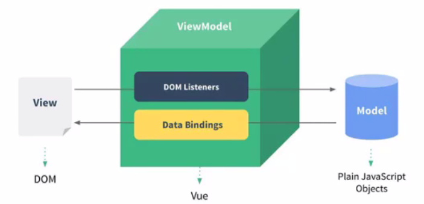
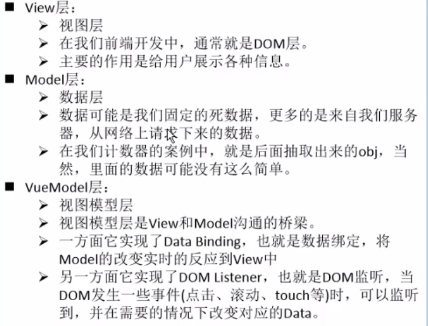

# 初识vue

- 渐进式框架，可以一点一点地重构
- vue全家桶：core+vue-router+vuex

## 为什么学vue

- 使用vue重构原有项目
-  新项目使用vue

## vue的特点

- 解耦视图和数据
- 可复用的组件
- 前端路由技术
- 状态管理
- 虚拟dom

## 一些重要概念

### 响应式

当数据发生改变的时候，界面会发生响应

### 语法糖

简写

### mvvm





## 创建一个vue对象，代码做了些什么（掌握）

```html
<body>
    <div id="app">{{ message }}</div>
    <script src="./js/vue_2.5.22.js"></script>
    <script>
        // 编程范式：声明式编程
        const app = new Vue({
            el: '#app',
            data: {
                message: 'hellovue'
            }
        })
        // 原先js 编程范式：命令式编程
        // 1.创建div元素，设置id属性

        // 2.定义一个变量叫message

        // 3.将message变量放在前面的div元素中显示

        // 4.修改message的数据

        // 将修改后的数据再次替换到div元素
    </script>
</body>
```

**传入了一些options: {}**

**{}中包含了el属性：该属性决定了这个vue对象挂载到哪个元素**

**{}中包含了data属性：该属性通常会存储一些数据**：

- ​	自己定义
- ​	来自服务器

## v-for（掌握）

```html
<body>
    <div id="app">
        <ul>
            <li v-for="item in number">{{ item }}</li>
        </ul>
    </div>
    <script src="./js/vue_2.5.22.js"></script>
    <script>
        // 编程范式：声明式编程
        const app = new Vue({
            el: '#app',
            data: {
                message: 'hellovue',
                number: ['1','2','3','4']
            }
        })
    </script>
</body>
```

- 不需要dom相关的拼接
- 响应式

## v-on（掌握）

```html
<body>
    <div id="app">
        <h2>当前计数{{ counter }}</h2>
        <button v-on:click="add">+</button>
        <button v-on:click="sub">-</button>
    </div>
    <script src="./js/vue_2.5.22.js"></script>
    <script>
        // 编程范式：声明式编程
        const app = new Vue({
            el: '#app',
            data: {
                counter: 0
            },
            methods: {
                add: function () {
                    this.counter++
                },
                sub: function () {
                    this.counter--
                }
            }
        })
    </script>
</body>
```

## 创建vue实例传入的options

- el
- data
- methods
- computed
- 一些生命周期函数

## 生命周期函数

在created()函数中是拿不到元素的，当打印元素的时候是**null/undefined**
